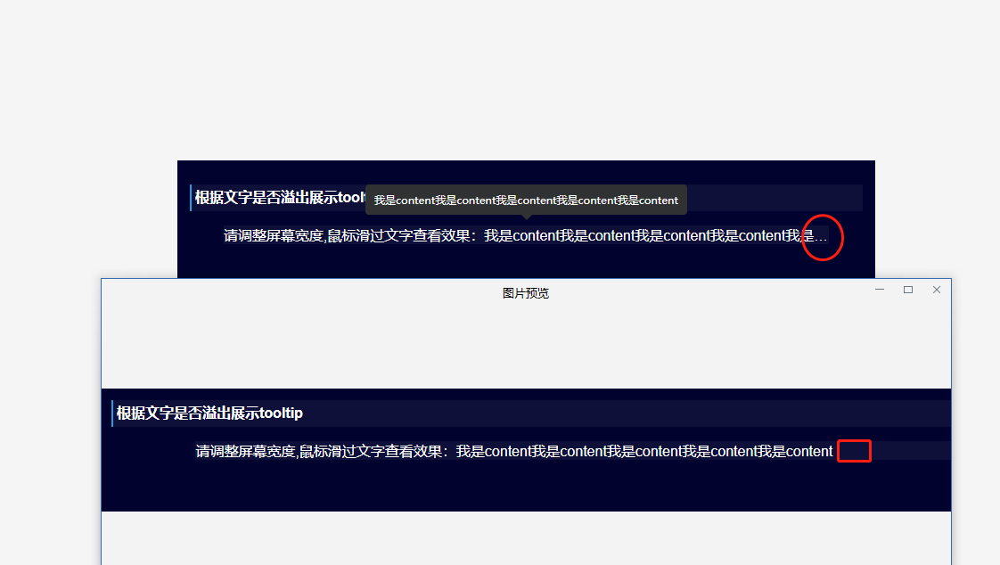

# v-response-tooltip 提示框

>简介：提示框主要继承于ElementUI [el-tooltip](https://element.eleme.cn/2.0/#/zh-CN/component/tooltip) 组件，由于el-tooltip不能响应式处理tooltip的展示情况，主要功能用于根据内容自适应展示tooltip提示框

### 根据文字是否溢出展示tooltip
```
<style>
.value {
  width: 100%;
  white-space: nowrap;
  overflow: hidden;
  text-overflow: ellipsis;
}
</style>
```
```html
  <el-row>
    <el-col :span="8">
      <v-response-tooltip
        content="我是content我是content我是content我是content我是content"
        placement="top"
        :over-width-display="true">
        <div class="value">我是content我是content我是content我是content我是content</div>
      </v-response-tooltip>
    </el-col>
  </el-row>
```
**如下图:**



### 始终展示tooltip

```html
  <el-row>
    <el-col :span="8">
      <v-response-tooltip
        content="我是content我是content我是content我是content我是content"
        placement="top"
        :over-width-display="false">
        <div class="value">我是content我是content我是content我是content我是content</div>
      </v-response-tooltip>
    </el-col>
  </el-row>
```
**如下图:**


### Props
| 参数      | 说明                                                | 类型            | 可选值 | 默认值                                           |
| --------- | --------------------------------------------------- | --------------- | ------ | ---- |
| over-width-display | 超过显示宽度时是否支持tooltip显示（需要获取元素宽度，故不支持行内样式），该设置如果为false时，按照所有el-tooltip配置                                                     | Boolean          | true/false    | true|
